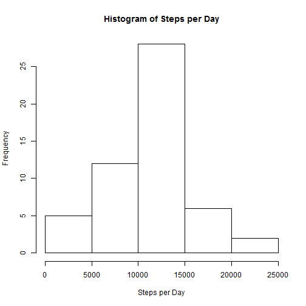
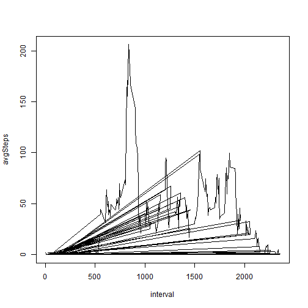
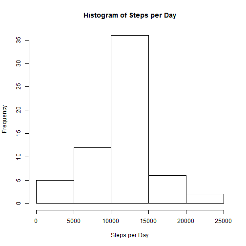
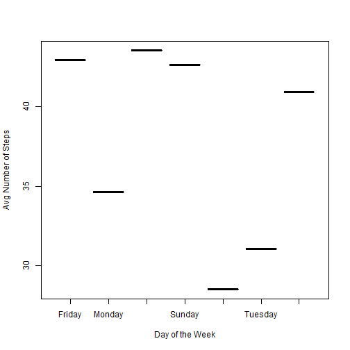
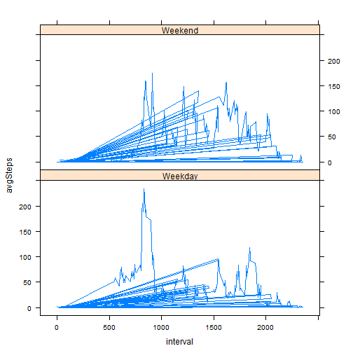

# Reproducible Research: Peer Assessment 1

## Loading and preprocessing the data


```r
data <- read.csv("activity.csv", colClasses = "character")
data$steps <- as.numeric(data$steps)
```

## Remove NAs


```r
data1 <- is.na(data$steps)
data2 <- data[!data1,]
data2$date <- as.Date(data2$date)
data2$steps <- as.numeric(data2$steps)
data2$day <- weekdays(data2$date)
```


```r
head(data2)
```

```
##     steps       date interval     day
## 289     0 2012-10-02        0 Tuesday
## 290     0 2012-10-02        5 Tuesday
## 291     0 2012-10-02       10 Tuesday
## 292     0 2012-10-02       15 Tuesday
## 293     0 2012-10-02       20 Tuesday
## 294     0 2012-10-02       25 Tuesday
```

## What is mean total number of steps taken per day?


```r
dataStepsDay <- tapply(data2$steps, data2$date, sum)
mean(dataStepsDay)
```

```
## [1] 10766
```

```r
median(dataStepsDay)
```

```
## [1] 10765
```

```r
hist(dataStepsDay, main = "Histogram of Steps per Day", xlab = "Steps per Day")
```

 

## What is the average daily activity pattern?


```r
data6 <- tapply(data2$steps, data2$interval, mean)
data7 <- data.frame(as.numeric(names(data6)), as.numeric(data6))
names(data7) <- c("interval", "avgSteps")
head(data7)
```

```
##   interval avgSteps
## 1        0   1.7170
## 2       10   0.1321
## 3      100   0.3208
## 4     1000  40.5660
## 5     1005  26.9811
## 6     1010  42.4151
```

```r
with(data7, plot(interval, avgSteps, type = "l"))
```

 
## Which 5-minute interval, on average across all the days in the dataset, contains the maximum number of steps?


```r
maxIntervalData <- data7[data7$avgSteps == max(data7$avgSteps),]
maxIntervalData$interval
```

```
## [1] 835
```

## Imputing missing values


```r
sum(data1)
```

```
## [1] 2304
```

There are 2304 missing values.

## Filling in Missing Values


```r
head(data)
```

```
##   steps       date interval
## 1    NA 2012-10-01        0
## 2    NA 2012-10-01        5
## 3    NA 2012-10-01       10
## 4    NA 2012-10-01       15
## 5    NA 2012-10-01       20
## 6    NA 2012-10-01       25
```

```r
dataImp <- data
dataImp$fix <- is.na(dataImp$steps)
dataImp$fix1 <- as.numeric("NA")
```

```
## Warning: NAs introduced by coercion
```

```r
for(i in 1:nrow(dataImp)){
        if(dataImp$fix[i]==TRUE){
                dataImp$fix1[i] <- mean(data2$steps)
        }else{
                dataImp$fix1[i] <- dataImp$steps[i]      
        }
}
```

## Histogram with Imputed Values


```r
dataStepsImp <- tapply(dataImp$fix1, dataImp$date, sum)
hist(dataStepsImp, main = "Histogram of Steps per Day", xlab = "Steps per Day")
```

 

## Mean and Median with Imputed Values


```r
mean(dataStepsImp)
```

```
## [1] 10766
```

```r
median(dataStepsImp)
```

```
## [1] 10766
```

The mean with Imputed Values is: 1.0766 &times; 10<sup>4</sup>
The median with Imputed Values is: 1.0766 &times; 10<sup>4</sup>

## Are there differences in activity patterns between weekdays and weekends?


```r
data3 <- tapply(data2$steps, data2$day, mean)
data4 <- data.frame(names(data3), as.numeric(data3))
names(data4) <- c("day", "avgSteps")
data4
```

```
##         day avgSteps
## 1    Friday    42.92
## 2    Monday    34.63
## 3  Saturday    43.53
## 4    Sunday    42.63
## 5  Thursday    28.52
## 6   Tuesday    31.07
## 7 Wednesday    40.94
```

```r
with(data4, plot(day, avgSteps, type = "", xlab = "Day of the Week", ylab = "Avg Number of Steps"))
```

 


```r
data10 <- data2
data10$dayType <- "NA"
for(i in 1:nrow(data10)){
        if(data10$day[i]== "Saturday" | data10$day[i]== "Sunday"){
                data10$dayType[i] <- "Weekend"
        }else{
                data10$dayType[i] <- "Weekday"  
        }
}
head(data10)
```

```
##     steps       date interval     day dayType
## 289     0 2012-10-02        0 Tuesday Weekday
## 290     0 2012-10-02        5 Tuesday Weekday
## 291     0 2012-10-02       10 Tuesday Weekday
## 292     0 2012-10-02       15 Tuesday Weekday
## 293     0 2012-10-02       20 Tuesday Weekday
## 294     0 2012-10-02       25 Tuesday Weekday
```

```r
dataWeekday <- data10[data10$dayType =="Weekday",]

dataWeekend <- data10[data10$dayType =="Weekend",]

data11 <- tapply(dataWeekday$steps, dataWeekday$interval, mean)
data12 <- data.frame(as.numeric(names(data11)), as.numeric(data11))
names(data12) <- c("interval", "avgSteps")
data12$dayType = "Weekday"
head(data12)
```

```
##   interval avgSteps dayType
## 1        0   2.3333 Weekday
## 2       10   0.1795 Weekday
## 3      100   0.4359 Weekday
## 4     1000  37.4615 Weekday
## 5     1005  16.8718 Weekday
## 6     1010  38.5641 Weekday
```

```r
data15 <- tapply(dataWeekend$steps, dataWeekend$interval, mean)
data16 <- data.frame(as.numeric(names(data15)), as.numeric(data15))
names(data16) <- c("interval", "avgSteps")
data16$dayType = "Weekend"
head(data16)
```

```
##   interval avgSteps dayType
## 1        0     0.00 Weekend
## 2       10     0.00 Weekend
## 3      100     0.00 Weekend
## 4     1000    49.21 Weekend
## 5     1005    55.14 Weekend
## 6     1010    53.14 Weekend
```

```r
allData <- rbind(data12,data16)
allData$interval <- as.numeric(allData$interval)
allData$avgSteps <- as.numeric(allData$avgSteps)
allData$dayType <- factor(allData$dayType)

library(lattice)
xyplot(avgSteps ~ interval | dayType, data = allData, type = "l", layout = c(1,2))
```

 

